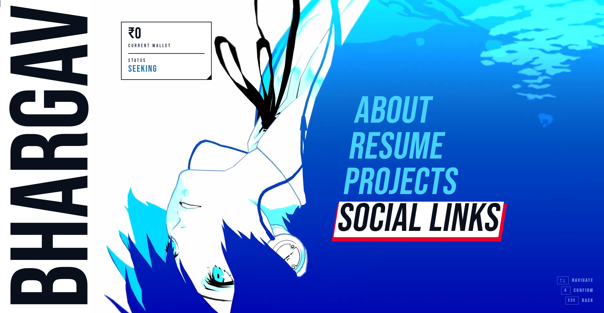
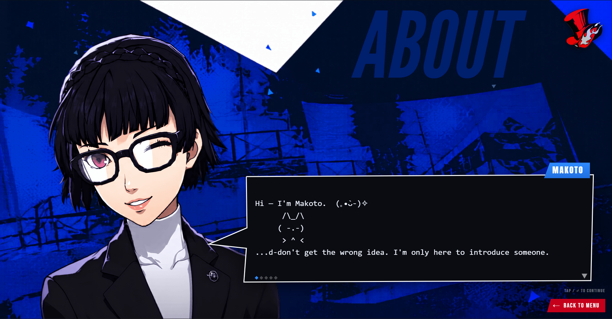
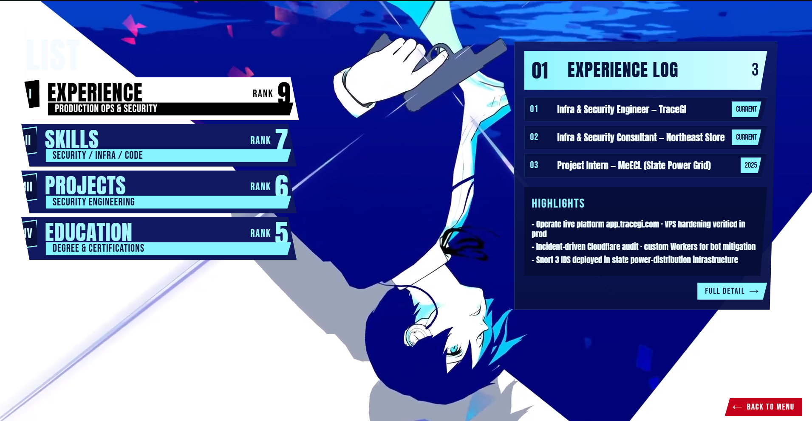
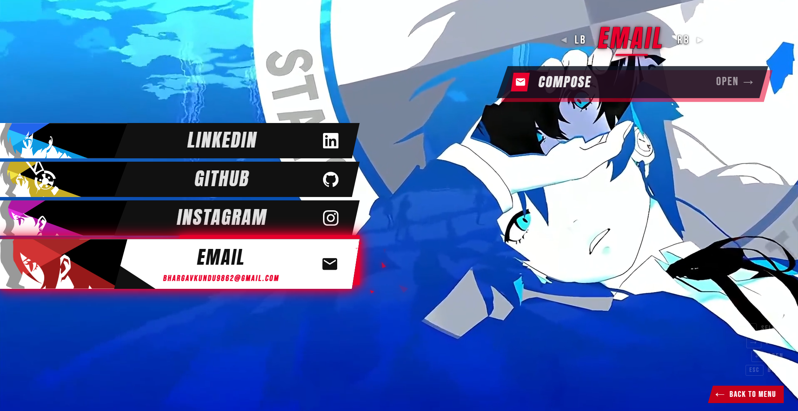

<div align="center">

# ⚔️ Bhargav's Persona

### A personal portfolio built as a **Persona 3 Reload** main menu.

[](https://www.zykan.me)
[](https://nextjs.org)
[](https://www.typescriptlang.org)
[](LICENSE)

*Editorial, minimal, and unapologetically themed after the cleanest UI in gaming.*

</div>

---

> **A note before you scroll:** this is a fan project. The code is open and MIT-licensed —
> the **Persona artwork, fonts, music and video are © Atlus / Sega** and are **not** mine to
> license. See [Assets & Credits](#-assets--credits) before you fork. Swap them for your own and
> you've got a clean, original template.

---

## ✨ What it is

A single-page personal site that behaves like the Persona 3 Reload menu — vertical hero name,
HUD wallet/status panel, a skewed cyan nav, and full-screen sub-views for **About**, **Resume**,
**Projects**, and **Social Links**. Everything is laid out in viewport units so the whole 16:9
frame scales as one composition.

| | |
|---|---|
| 🎮 **P3R-faithful UI** | Skewed nav, red active underlay, HUD panels, SFX on navigate/confirm |
| 🗂️ **Data-driven Resume** | Edit three arrays at the top of `Resume.tsx` — never the JSX |
| 💬 **Persona dialogue easter egg** | About page renders a Social-Link style typewriter box (SVG, in code) |
| 🔗 **Animated Social Links** | Per-link accent glow + floating "shatter" particles |
| ⚡ **Zero UI deps** | Just Next.js + framer-motion — the design lives in the components |

> 🃏 **Side note:** yes, the About page guest-stars **Makoto Niijima** — and yes, I know she's
> from **Persona 5**, not 3. 😄 She's my personal favourite, so she got a cameo in my P3R-themed
> menu. Consider it a deliberate cross-over, not a lore slip.

---

## 📸 Screenshots

> Drop the images into `docs/screenshots/` with these exact names and they'll appear below.
> A GIF of the menu animating works great as the first one.

<div align="center">

| Main Menu | About |
|:---:|:---:|
|  |  |
| **Resume** | **Social Links** |
|  |  |

</div>

---

## 🛠️ Tech Stack

- **[Next.js 16](https://nextjs.org)** (App Router) + **React 19**
- **TypeScript**
- **[framer-motion](https://www.framer.com/motion/)** for animation
- **Tailwind CSS v4**
- Deployed on **[Vercel](https://vercel.com)** → live at **[zykan.me](https://zykan.me)**

---

## 🚀 Getting Started

```bash
git clone https://github.com/7Bhargav7/Persona-themed-website.git
cd Persona-themed-website
npm install
npm run dev          # → http://localhost:3000
```

> ⚠️ **Judge the design at 100% browser zoom.** Every element uses `vw`/`vh`, so the whole
> layout scales together. If something only looks right at 80%/125%, the *value* is wrong —
> fix the value, don't rely on zoom.

### Make it yours
1. Swap the contents of `components/Resume.tsx`, `About.tsx`, and `Socials.tsx` with your own data
   (each has clearly labelled data arrays at the top of the file).
2. Replace the media in `public/` with your own assets (**required** — see below).
3. Update fonts/colors in `app/layout.tsx` and `app/globals.css`.

---

## 🗂️ Project Structure

```
app/
  layout.tsx        # fonts + global metadata
  globals.css       # theme tokens & colors
  page.tsx          # mounts the menu
components/
  Menu.tsx          # ⭐ the whole main-menu composition lives here
  Resume.tsx        # data-driven résumé (edit the arrays, not the JSX)
  About.tsx         # Persona dialogue-box easter egg
  Socials.tsx       # animated social links + shatter particles
  Sideprojects.tsx  # projects screen
  Transition.tsx    # screen-to-screen transitions
  useIsMobile.ts    # matchMedia hook for the mobile reflow
public/             # videos, images, fonts, audio, sfx  (Atlus assets — replace these)
```

**Palette:** cyan `#48d2ff` · white `#ffffff` · red `#e8002d` · navy `#0a0f1c` · status blue `#1f6fb2`

---

## 🙏 Assets & Credits

**Code lineage** — this started as a fork and was heavily reworked:
- Original concept: **[blairxu13/persona3-website](https://github.com/blairxu13/persona3-website)**
- Forked via: **[mikedimeji/persona-portfolio](https://github.com/mikedimeji/persona-portfolio)**
- Rebuilt, redesigned and rewritten by **[Bhargav Kundu](https://github.com/7Bhargav7)**

**Game assets** — *Persona 3 Reload* and *Persona 5* are **© Atlus / Sega**. The videos, character
art, fonts (`Persona`, `Skip Std`) and music in this repo are used here **for non-commercial,
personal/fan purposes only** and are **not covered by this project's license**. If you fork this,
please **replace them with assets you have the right to use.**

---

## 📄 License

The **code** in this repository is released under the **[MIT License](LICENSE)** — fork it, learn
from it, build your own. The **bundled game assets are excluded** from that license (see above).

---

<div align="center">

Built by **Bhargav Kundu** · [zykan.me](https://zykan.me) · [@7Bhargav7](https://github.com/7Bhargav7)

</div>
